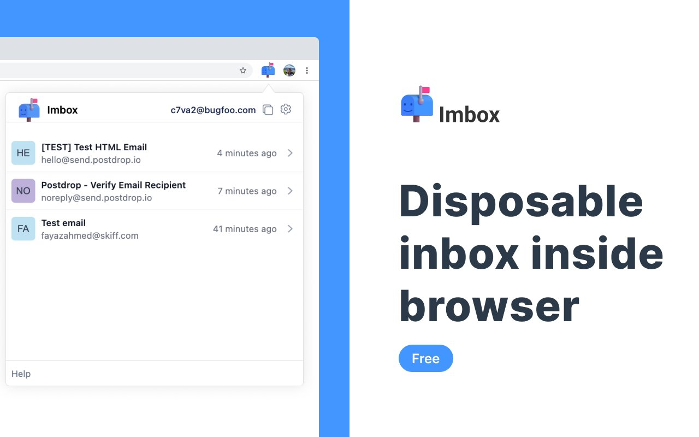

# Imbox

A chrome extension with with disposable inboxes right inside your browser.

Imbox is built on top of https://mail.tm api, which is a free disposable email service.

## Features

1. Create disposable inboxes
2. Receive emails in realtime (when the extension is open)

You can download the extension here https://chrome.google.com/webstore/detail/imbox/jdbekibldobfcglhedhkpdeliiicalii

## Roamap

1. Delete messages
2. Create new inboxes
3. Delete inboxes
4. Mark messages as read
5. Mark messages as unread
6. Attachment support
7. Search messages
8. Make the navigation better

## Development

1. Clone the repo
2. Run `pnpm install`
3. Run `pnpm dev`

Load the folder `/extension/dev` as an unpacked extension to start using the extension.

## Build

1. Run `pnpm build`
2. Load the folder `/extension/prod` as an unpacked extension to start using the extension.
